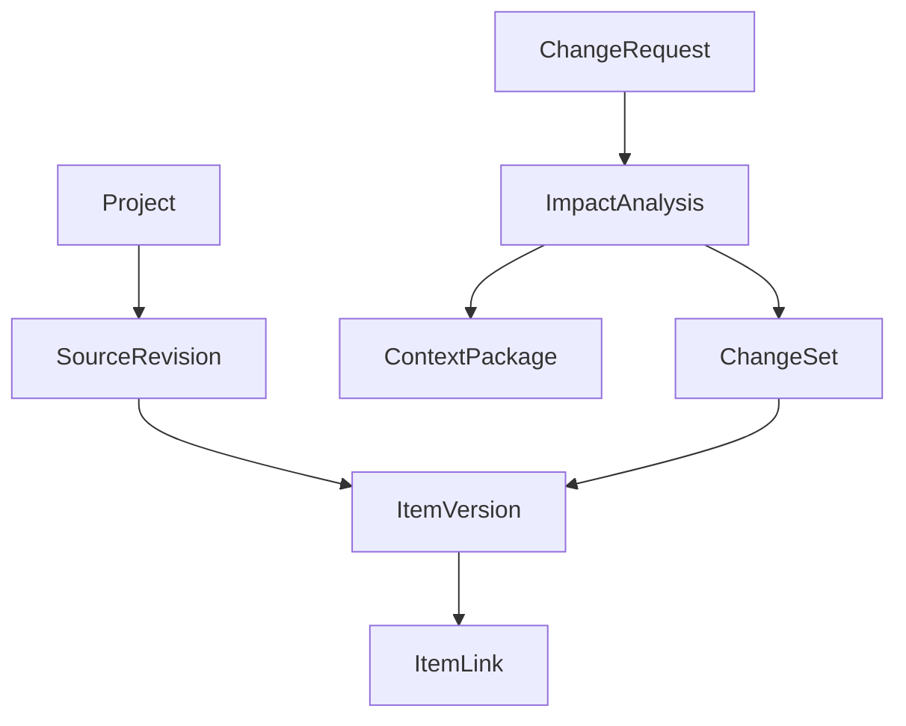

# Engram: возврат к исходной проблеме и план корректировки проекта

**Статус документа:** стратегическое и техническое решение по дальнейшему развитию  
**Основание аудита:** репозиторий `Axx-Axvd/Engram`, ветка `main`, состояние на 1 августа 2026 года, коммит `6b06393`; `README.md`; текущий и старый `ROADMAP.md`; исходная спецификация проекта  
**Граница документа:** проблематика, архитектура решения, исследовательская проверка и ближайшая разработка. Продажи, цены и дальняя монетизация намеренно не рассматриваются.

---

## 1. Решение в одном абзаце

Engram не нужно закрывать и не нужно переписывать с нуля. В проекте уже создан хороший технический фундамент: типизированные артефакты, версии, связи, поиск, два сквозных сценария, проверки согласованности, модульный сервер и рабочий интерфейс. Однако дальнейшее развитие необходимо развернуть. Engram должен перестать становиться самостоятельным местом для написания и хранения проектной документации. Его основной задачей должен стать **доказуемый анализ последствий изменений и формирование проверенного контекста для ИИ-агента на основе уже существующих источников проекта**.

Главный продуктовый сценарий следует зафиксировать так:

> Пользователь или агент передаёт изменение. Engram находит конкретные требования, решения, задачи, участки реализации и тесты, которые могут быть затронуты; объясняет каждое попадание ссылками на источники; формирует ограниченный пакет актуального контекста; после подтверждения фиксирует причинно связанную группу изменений и проверяет, не возникло ли рассогласование.

Всё, что непосредственно не усиливает этот сценарий, необходимо либо заморозить, либо убрать из ближайшего плана.

---

## 2. Что является «истинным путём» Engram

### 2.1. Проблема

Исходная спецификация верно заметила, что знания длительно развиваемого проекта нельзя надёжно держать в одном диалоге с языковой моделью. Но формулировку проблемы необходимо сделать точнее. Недостаток памяти модели сам по себе уже не является достаточным основанием для отдельного продукта: современные агенты умеют читать проектные инструкции, файлы репозитория и накопленную память.

Настоящая проблема Engram звучит так:

> В длительно развиваемом программном проекте сведения распределены между требованиями, решениями, задачами, кодом, тестами и историей изменений. После нового изменения человек и ИИ-агент не знают наверняка, какие сведения всё ещё актуальны, какие зависимости затронуты и какой минимальный контекст необходимо использовать, чтобы не пропустить последствия изменения.

Из этой формулировки следуют четыре обязательных свойства решения:

1. **Трассируемость:** Engram знает, откуда получено каждое утверждение и с чем оно связано.
2. **Временная актуальность:** Engram различает действующую, заменённую и историческую информацию.
3. **Анализ влияния:** Engram работает не с документом целиком, а с конкретными элементами проекта и показывает цепочку последствий.
4. **Доставка контекста:** результат используется агентом в его рабочем процессе, а не остаётся красивой страницей внутри отдельного приложения.

### 2.2. Что Engram не должен пытаться заменить

Engram не должен становиться:

- заменой Confluence, Notion или Google Docs;
- самостоятельным диспетчером задач;
- полноценной системой управления жизненным циклом разработки;
- универсальной «операционной системой для агентов»;
- ещё одной долговременной памятью, сохраняющей произвольные заметки;
- генератором требований, историй и тестов ради самой генерации;
- графом знаний без проверяемой пользы для анализа изменений.

### 2.3. Критерий допуска любой новой функции

Перед добавлением функции необходимо задать вопрос:

> Улучшает ли она точность анализа влияния, доказуемость связей, актуальность данных или передачу контекста агенту?

Если ответ отрицательный, функция не входит в ближайшую разработку. Приятный редактор, комментарии, оформление графа и новые виды страниц могут быть полезны, но они не проверяют основную гипотезу Engram.

---

## 3. Что фактически создано сейчас

Текущее приложение является **функциональным технологическим прототипом системы проектной документации с элементами связанной памяти**.

Серверная часть уже содержит:

- документы `Artifact` шести типов;
- массив структурированных пунктов `items` внутри документа;
- снимки `ArtifactVersion` и журнал `ChangeLog`;
- семь типов направленных связей между документами;
- векторный поиск и расширение результата на один или несколько шагов по графу;
- формализацию описания в набор документов;
- обработку запроса на изменение;
- семь правил проверки согласованности;
- абстракции для языковой модели и эмбеддингов;
- детерминированные заглушки и локальный провайдер Claude через Agent SDK.

Интерфейс уже содержит:

- обзор рабочего пространства;
- дерево документов;
- ручное создание и редактирование документов;
- полноценный редактор Tiptap с форматированием, таблицами, меню команд и сворачиваемыми блоками;
- ручное создание связей;
- историю версий;
- общий граф документов;
- отдельные страницы формализации, запроса на изменение и согласованности.

Это существенный объём качественно собранной инфраструктуры. Проблема не в отсутствии кода, а в том, что наиболее развитая часть продукта обслуживает авторство документов, а наиболее важная гипотеза — точный контекст и анализ влияния — пока реализована в упрощённом виде.

---

## 4. Главные расхождения между замыслом и реализацией

| Область | Как должно быть | Как реализовано сейчас | Последствие |
|---|---|---|---|
| Граница проекта | Каждый анализ выполняется внутри явно выбранного проекта и версии источников | Сущности `Project` нет; большинство запросов работают со всеми артефактами базы | Данные разных проектов могут смешаться в поиске, графе и отчёте согласованности |
| Единица знания | Отдельное требование, решение, задача, тест, модуль или фрагмент источника | Основная сущность — документ; пункты находятся в `items` как JSONB | Нельзя независимо версионировать пункт, связывать его с изменением и доказывать его происхождение |
| Подбор контекста | Ограниченный набор конкретных элементов с объяснением причин выбора | `context_service.select_context` выбирает документы по вектору и добавляет все документы на заданном числе шагов графа | Контекст может быстро разрастаться и не объясняет релевантность каждого элемента |
| Вход языковой модели | Пункты, активные версии, связи, источники и доказательства | `ContextItem` содержит только `id`, `type`, `title`, `content` документа | Машиночитаемый слой `items` и граф почти не участвуют в рассуждении модели |
| Анализ изменения | Сначала предложение и доказательства, затем подтверждение и применение | `analyze_change` сразу вызывает `update_artifact`, создаёт новые версии и помечает запрос `applied` | Непроверенный вывод модели становится новым состоянием проекта |
| Причинность | Конкретный запрос связан с конкретным набором изменённых версий | Проверка считает достаточным, что связанный документ когда-либо достиг версии выше первой | Нельзя доказать, что версия появилась именно вследствие данного запроса |
| Источник знания | Точный указатель на репозиторий, файл, диапазон, задачу, редакцию и время | `source_ref` — необязательная строка | Происхождение невозможно надёжно проверить или обновить |
| Связи | Связи на уровне элементов с типом, происхождением, уверенностью и подтверждением | Связи на уровне документов; проверяется только существование документов и отсутствие полного дубликата | Граф слишком грубый, а ошибочная связь выглядит равноправной ручной подтверждённой связи |
| Реальный проект | Engram читает существующие требования, решения, код и тесты | Основной путь создаёт данные внутри Engram из свободного описания | Демонстрируется генерация документации, а не помощь длительно развиваемому проекту |
| Канал использования | Контекст получает внешний агент или процесс проверки изменения | MCP, командная строка и интеграция с репозиторием отложены | Главная ценность не попадает в место, где выполняется работа |
| Проверка гипотезы | Сравнение точности, полноты и размера контекста с базовыми методами | Проверяется корректность API и прохождение заранее построенного демонстрационного сценария | Тесты подтверждают реализацию функций, но не преимущество подхода |

---

## 5. Самые критичные проблемы текущего кода

### P0. Нет изоляции проектов

Сейчас `Artifact`, `ArtifactLink`, поиск и проверка согласованности не имеют `project_id`. Эндпоинт `/api/consistency` проверяет всю базу, `/api/links` возвращает все связи, а `select_context` ищет по всем артефактам. Это не просто будущая функция для нескольких пользователей, а нарушение корректности уже при создании двух демонстрационных проектов.

**Решение:** добавить сущность `Project` и обязательный `project_id` во все проектные сущности. Рабочее пространство пользователей, роли и права пока не нужны; нужна только строгая предметная граница данных.

### P0. «Минимальный контекст» фактически не минимален и не доказан

Поиск выбирает несколько документов по близости вектора, а затем без весов и семантики добавляет соседей графа. Все связи рассматриваются одинаково. Ограничение `limit` действует только на начальные документы, но не на итоговый пакет после обхода графа. При наличии эмбеддинга переход к поиску по ключевым словам почти никогда не происходит, потому что эмбеддинг записывается при каждом создании документа, включая заглушку.

**Решение:** выполнять поиск на уровне элементов; разделить отбор кандидатов, расширение по типизированному графу, повторное ранжирование и укладку в бюджет контекста. Для каждого включённого элемента возвращать причины: совпавшие термины, путь по графу, активную версию и источник.

### P0. Структурированные пункты не передаются анализатору изменения

`ContextItem` и промпт `claude_code.py` передают модели только текст тела документа. Поля `items`, ссылки между пунктами, статусы версий и графовые связи остаются за пределами анализа. Следовательно, наиболее ценная структура Engram используется в проверках согласованности, но не в главном интеллектуальном сценарии.

**Решение:** контракт анализатора должен принимать не документы, а `ContextElement`: устойчивый идентификатор элемента, тип, текст, активную версию, источник, входящие и исходящие значимые связи, путь попадания в контекст и степень доверия.

### P0. Модель автоматически изменяет источник истины

Текущий `ProceduralWorkflowEngine.analyze_change` после ответа модели немедленно создаёт связи, заменяет содержимое каждого предложенного документа и переводит запрос в `applied`. В режиме заглушки обновляются все найденные кандидаты. Это делает красивым демонстрационный сценарий, но противоречит безопасной модели анализа изменений.

**Решение:** разделить процесс на три операции:

1. `analyze` — только расчёт и сохранение отчёта влияния;
2. `approve` — подтверждение или отклонение отдельных предложений человеком;
3. `apply` — создание причинно связанного набора изменений.

По умолчанию Engram не должен переписывать документы или код.

### P0. Нет причинного набора изменений

Правило `approved_cr_without_new_version` считает запрос выполненным, если у любого связанного документа `current_version > 1`. Документ мог быть изменён до запроса или по другой причине. Строка `reason` также не является надёжным внешним ключом.

**Решение:** добавить `ChangeSet` и явную связь `ChangeSetItem` с исходной и результирующей версиями элемента. Цепочка должна выглядеть так:

`ChangeRequest → ImpactAnalysis → ApprovedImpact → ChangeSet → ItemVersion`.

### P1. Две несогласованные истины: тело и `items`

Тело документа редактируется человеком, а пункты хранятся отдельно. Уже запланирован механизм «Sync items», но двусторонняя синхронизация неизбежно породит вопросы о конфликте и приоритете. Главная задача Engram не требует собственного богатого редактора.

**Решение:** источником истины должен быть внешний источник или явно сохранённая редакция источника. Структурированные элементы являются индексом и моделью знаний, производной от источника. Ручная правка элемента возможна как отдельное подтверждённое изменение, но не как незаметная синхронизация двух равноправных копий.

### P1. Происхождение и доверие к данным не моделируются

У связи нет полей `origin`, `confidence`, `rationale`, `evidence`, `confirmed_by`. Нельзя отличить ручную связь от догадки модели, а `source_ref` не указывает на конкретную редакцию.

**Решение:** каждое автоматически извлечённое утверждение и связь должны иметь источник, способ создания, уверенность и состояние подтверждения.

### P1. Связи семантически не ограничены

API позволяет создать любой `LinkType` между любыми типами документов. Проверяется только отсутствие связи с самим собой и точного дубликата. Например, тест может `tests` другой тест или запрос на изменение может `implements` описание проекта.

**Решение:** ввести таблицу допустимых комбинаций типов и направления связей. Нарушение должно отклоняться сервером. Связь `related_to` не следует использовать как удобную замену отсутствующей семантике.

### P1. Проверки согласованности слишком легко дают ложную уверенность

Формализованный заглушкой проект всегда создаёт одинаковое число требований, историй, задач и тестов с готовыми ссылками, поэтому отчёт закономерно чистый. Это проверяет замкнутость сгенерированного шаблона, а не согласованность реального проекта. Кроме того, наличие ссылки от сущности нужного типа ещё не доказывает содержательное покрытие.

**Решение:** разделить структурные правила и смысловые предположения. Структурные правила могут давать ошибку детерминированно. Смысловые проверки должны возвращать предложение с уверенностью и доказательствами, а не безусловный факт.

### P2. Интерфейс визуально закрепляет неверную модель продукта

Главная страница считает документы и пункты, верхняя панель предлагает создать документ, боковая панель построена вокруг дерева документов, а rich-text-редактор стал одной из самых проработанных частей приложения. История коммитов также показывает, что значительная доля последних изменений была посвящена оболочке, стилю и редактору.

**Решение:** интерфейс необходимо сохранить как демонстрационный каркас, но изменить центр навигации: `Projects → Sources → Changes → Impact analyses → Context packages`. Документы становятся одним из источников, а не центром продукта.

---

## 6. Что сохранить

Следующие части проекта соответствуют истинному пути и должны стать основой переработки.

### Серверная архитектура

Сохранить разделение `api → services → repositories → models`. Оно достаточно простое, понятно проверяется и не требует преждевременной оркестрационной платформы.

### Адаптеры языковой модели и эмбеддингов

Сохранить `LLMProvider`, `EmbeddingProvider`, фабрики и детерминированные заглушки. Изменить потребуется их предметный контракт, а не сам принцип абстракции. Провайдер Claude через локальную подписку полезен для исследовательских запусков, но не должен определять архитектуру продукта.

### PostgreSQL и pgvector

Сохранить PostgreSQL, SQLAlchemy, Alembic и pgvector. Отдельная графовая база не требуется: текущий объём и ближайшие запросы нормально выражаются в реляционной модели и рекурсивных запросах.

### Неизменяемые версии

Сохранить идею неизменяемых снимков и одной активной версии, но перенести точность версионирования на уровень элементов и связать версии с `ChangeSet`.

### Типизированные связи

Сохранить направленные типы связей и развить их до уровня элементов. Это один из основных активов проекта.

### Проверки согласованности

Сохранить детерминированный механизм правил, разделив строгие структурные нарушения и вероятностные смысловые предупреждения.

### Тестовый подход

Сохранить модульные тесты, проверку API и сквозной сценарий. Текущие 30 тестов являются хорошей защитой от регрессий, хотя ещё не доказывают ценность метода.

### Интерфейс как средство демонстрации

Сохранить общий каркас Next.js, запросы через типизированный API, страницы графа, истории и отчёта. Не выбрасывать уже написанное; прекратить расширять редактор и постепенно сменить предметные экраны.

---

## 7. Что изменить

### 7.1. Переименовать результат текущего этапа

В `README.md` и `ROADMAP.md` заменить формулировку «MVP пройден» на:

> «Завершён функциональный прототип хранения связанных и версионируемых артефактов».

Это важно не ради терминологии. Нынешняя формулировка создаёт впечатление, что основная гипотеза уже проверена, и направляет разработку к наращиванию функций вокруг неподтверждённого ядра.

### 7.2. Сменить главный сценарий

`formalize` следует оставить как вспомогательный импорт исходного описания и генератор демонстрационных данных. Главным сценарием становится `analyze_change` над существующим проектом.

Требуемое поведение:

1. Пользователь выбирает проект и источник изменения.
2. Engram фиксирует редакции источников, на которых выполняется анализ.
3. Детерминированный поиск находит кандидатов.
4. Граф расширяет кандидатов только по разрешённым и взвешенным связям.
5. Модель классифицирует влияние и объясняет его, но не меняет данные.
6. Пользователь подтверждает или отклоняет результаты.
7. Engram формирует пакет контекста для внешнего агента.
8. После фактической работы Engram связывает получившиеся изменения с исходным запросом и повторно проверяет согласованность.

### 7.3. Перейти от документа к элементу

Необходимо ввести нормализованную сущность `ArtifactItem` вместо хранения всех пунктов только массивом JSONB.

Минимальные поля:

- `id` — глобально устойчивый идентификатор;
- `project_id`;
- `artifact_id` — контейнер или источник;
- `key` — понятный человеку локальный ключ;
- `type` — requirement, decision, task, test, code_component и другие необходимые типы;
- `title`, `text`, `status`;
- `current_version_id`;
- `source_locator_id`;
- `valid_from`, `valid_to` или эквивалентная временная модель;
- `created_at`, `updated_at`.

Отдельная `ItemVersion` хранит снимок текста, статуса, источника и автора изменения. Существующий `items` JSONB можно временно поддерживать как совместимое представление, но новые функции должны работать через нормализованные таблицы.

### 7.4. Сделать связи доказуемыми

Новая `ItemLink` должна содержать:

- исходный и целевой элемент;
- тип и направление;
- `origin`: manual, imported, inferred;
- `confidence` для автоматического вывода;
- краткое обоснование;
- набор `EvidenceRef`;
- состояние: proposed, confirmed, rejected, stale;
- кто и когда подтвердил связь;
- версия источников, на которой связь была рассчитана.

Документные связи можно сохранить для обзора, но желательно рассчитывать их как сводное представление над связями элементов.

### 7.5. Переделать выбор контекста в конвейер

`context_service.select_context` должен стать конвейером из отдельных проверяемых стадий:

1. **Ограничение области:** только выбранный проект и активная редакция источников.
2. **Извлечение кандидатов:** поиск по ключевым словам, эмбеддингам, типам и явным идентификаторам.
3. **Расширение по графу:** разные веса для `implements`, `tests`, `depends_on`, `changes`; ограничение глубины и числа элементов.
4. **Повторное ранжирование:** оценка релевантности запросу и потенциального влияния.
5. **Бюджет:** ограничение по числу элементов или токенов.
6. **Объяснение:** для каждого результата — причина и путь попадания.
7. **Снимок:** сохранение точного состава пакета и версий элементов для воспроизводимости.

Итоговый `ContextBundle` должен содержать не только сущности и связи, но и `reason`, `score`, `graph_path`, `source_locator`, `version`, `token_estimate`.

### 7.6. Изменить контракт языковой модели

Модель не должна получать неструктурированную россыпь полных документов. Новый контракт анализа должен возвращать:

- идентификатор затронутого элемента;
- вид влияния: modify, verify, potentially_stale, no_change;
- степень уверенности;
- обоснование;
- ссылки на использованные доказательства;
- предлагаемое действие;
- необязательный проект изменения, который не применяется автоматически.

Парсер обязан отклонять неизвестные элементы, отсутствующие доказательства, дубли и несовместимые типы влияния. Частично корректный ответ не должен незаметно превращаться в успешный анализ.

### 7.7. Разделить анализ и изменение

`ProceduralWorkflowEngine.analyze_change` необходимо заменить набором прикладных служб:

- `ImpactAnalysisService.create_analysis`;
- `ImpactAnalysisService.review_candidate`;
- `ContextPackageService.build`;
- `ChangeSetService.apply`;
- `ConsistencyService.check_changeset`.

Для этого не требуется LangGraph. Явная процедурная машина состояний будет проще, прозрачнее и лучше подходит для дипломного исследования.

### 7.8. Перестроить интерфейс вокруг изменения

Главная страница должна показывать:

- выбранный проект;
- подключённые источники и их актуальность;
- последние запросы на изменение;
- незавершённые проверки влияния;
- устаревшие или неподтверждённые связи;
- последние пакеты контекста.

На странице анализа изменения необходимо показывать не граф ради графа, а таблицу кандидатов с доказательствами, путём связи, уверенностью и действиями «подтвердить», «отклонить», «нужна проверка».

---

## 8. Что добавить

### 8.1. `Project` как обязательную границу

Добавить `Project`, миграцию существующих данных в один проект по умолчанию и `project_id` в артефакты, элементы, связи, запросы, анализы и отчёты. Все репозитории и API должны требовать область проекта.

### 8.2. Модель источников и происхождения

Добавить:

- `Source` — репозиторий, документ, задача или ручной ввод;
- `SourceRevision` — commit SHA, версия документа или иной неизменяемый снимок;
- `SourceLocator` — файл, раздел, диапазон строк, URL или внешний идентификатор;
- `EvidenceRef` — связь вывода Engram с конкретным фрагментом источника.

Без этих сущностей нельзя отличить воспроизводимый анализ от ответа модели «по памяти».

### 8.3. Элементы реализации

Добавить типы, связывающие проектные намерения с реализацией:

- `decision` — архитектурное или продуктовое решение;
- `issue` или `work_item`;
- `code_component` — сначала файл или модуль, без преждевременного анализа каждой функции;
- `test` — автоматизированный или ручной тест;
- `pull_request` и `commit` как импортируемые события;
- `change_request` как исходное намерение изменения.

Не все из них обязаны быть ручными документами. Большинство должно создаваться адаптером источника.

### 8.4. `ImpactAnalysis` и `ChangeSet`

Добавить отдельные сущности для результата анализа и фактически применённого изменения. Анализ должен хранить:

- входной запрос;
- версии источников;
- версию алгоритма и модели;
- найденных кандидатов;
- доказательства;
- решения пользователя;
- сформированный пакет контекста;
- итоговую оценку после фактического изменения.

### 8.5. Один реальный адаптер источника

Выбрать только GitHub или локальный Git-репозиторий. На первом шаге достаточно импортировать:

- Markdown-спецификации и ADR;
- issue;
- pull request;
- commit;
- изменённые файлы;
- тестовые файлы и, при доступности, результаты запуска тестов.

Не следует одновременно подключать Jira, Confluence, Linear и Notion. Один качественный сквозной источник полезнее пяти неполных.

### 8.6. Канал выдачи контекста

После готовности доказуемого `ContextBundle` добавить минимальный интерфейс командной строки или MCP с двумя операциями:

- `analyze_change(query, project)`;
- `get_context(analysis_id, budget)`.

MCP не является уникальностью Engram, но без канала доставки ядро не проверяется в реальной работе агента. Поэтому интеграцию не нужно ставить раньше модели элементов, но нельзя откладывать до неопределённого «когда-нибудь».

### 8.7. Исследовательский набор и измерения

Подготовить набор из 20–30 реальных или тщательно размеченных изменений. Для каждого изменения заранее отметить затронутые требования, решения, файлы и тесты. Сравнивать:

1. полный контекст проекта;
2. только поиск по эмбеддингам;
3. только графовые связи;
4. Engram: поиск + типизированный граф + версии + бюджет.

Измерять:

- полноту найденных зависимостей;
- точность и долю ложных предупреждений;
- F1-меру;
- размер контекста в токенах;
- время и стоимость анализа;
- успешность выполнения последующей задачи агентом;
- воспроизводимость результата на фиксированной редакции источников.

Это одновременно проверяет исходную проблематику, даёт сильную основу дипломной работе и предотвращает разработку функций без доказанной пользы.

---

## 9. Что убрать из активного сценария

Под «убрать» здесь понимается прекращение использования в основном сценарии, а не обязательное немедленное удаление кода.

### Автоматическое применение ответа модели

Убрать немедленный вызов `update_artifact` из анализа изменения. Запрос не может автоматически получать статус `applied`, если пользователь не подтвердил изменения и система не зафиксировала их причинную связь.

### Полные документы как единственную единицу контекста

Убрать передачу только `title + content`. Документ может оставаться контейнером, но анализ должен работать с элементами и доказательствами.

### Глобальные операции над всей базой

Убрать неограниченные проектом `/api/links`, `/api/consistency` и поиск. Даже локальный однопользовательский прототип должен уметь различать проекты.

### Равноправие всех связей

Убрать безусловное расширение по любому ребру графа. Тип, направление, подтверждение и актуальность связи должны влиять на результат.

### Формулировку «готовый MVP»

Убрать её из дорожной карты и документации до тех пор, пока не будет доказан один реальный сквозной сценарий на существующем проекте.

### Обязательную синхронизацию rich-text и `items`

Не строить сложный двусторонний механизм, который будет пытаться поддерживать две независимые версии одного знания. Сначала определить внешний источник истины и однонаправленное извлечение элементов с подтверждением.

---

## 10. Что заморозить

Следующие направления не удаляются, но по ним не следует принимать новые задачи до прохождения критериев нового исследовательского ядра.

### Заморозить полностью

- дальнейшее развитие rich-text-редактора;
- комментарии, совместное редактирование и уведомления;
- роли, команды, права и многопользовательский режим;
- улучшение визуального стиля и переход на другую библиотеку интерфейса;
- украшение графа, сложная автоматическая раскладка и анимации;
- DOCX, PDF и другие форматы экспорта;
- Neo4j и отдельную графовую инфраструктуру;
- LangGraph и многоагентную оркестрацию;
- генерацию UML;
- автоисправление отчёта согласованности;
- прямую поддержку нескольких облачных моделей;
- интеграции с Jira, Confluence, Notion, Slack и другими системами;
- продвинутый деплой, наблюдаемость и облачную платформу сверх минимального запуска эксперимента.

### Заморозить условно

- **генерацию документов:** оставить только для демо, начальной загрузки и тестовых данных;
- **ручное создание документов:** сохранить, но не улучшать;
- **общий граф:** сохранить как диагностическое представление, но не делать его главным экраном;
- **провайдер Claude Code:** использовать для испытаний, но не строить вокруг локального CLI продуктовый контракт;
- **AI-подсказки связей:** вернуться к ним только после добавления происхождения, уверенности, доказательств и подтверждения человеком;
- **DecisionRecord как документ:** вместо нового вида страницы сначала добавить `decision` как элемент предметной модели и источник влияния.

---

## 11. Целевой сквозной сценарий ближайшей версии

### Подготовка проекта

1. Пользователь создаёт проект Engram.
2. Подключает один Git-репозиторий или загружает его локальный снимок.
3. Engram фиксирует commit SHA и извлекает спецификации, решения, задачи, компоненты и тесты.
4. Автоматически предложенные элементы и связи имеют источники и степень уверенности.
5. Пользователь подтверждает критичные связи или оставляет их как предположения.

### Анализ изменения

1. Пользователь передаёт issue или текст запроса на изменение.
2. Engram создаёт `ImpactAnalysis` на конкретной редакции проекта.
3. Поиск формирует кандидатов на уровне элементов.
4. Граф добавляет вероятные последствия по разрешённым связям.
5. Модель классифицирует влияние и формирует объяснения.
6. Engram показывает таблицу затронутых элементов и доказательств.
7. Пользователь подтверждает результат.

### Передача агенту

1. Engram формирует воспроизводимый `ContextPackage` в заданном бюджете.
2. Агент получает требования, решения, затронутые компоненты, тесты и ограничения.
3. В пакете нет всего проекта; каждый включённый элемент имеет причину включения и ссылку на источник.

### Завершение изменения

1. После commit или pull request Engram импортирует фактический diff.
2. Создаёт `ChangeSet` и связывает фактические изменения с подтверждённым анализом.
3. Проверяет, какие элементы должны быть обновлены, какие тесты затронуты и какие связи устарели.
4. Сохраняет результат как новый эталон для оценки качества следующих анализов.

---

## 12. Предлагаемая предметная модель

Минимальный набор новых сущностей:

| Сущность | Назначение |
|---|---|
| `Project` | Изолирует данные и задаёт область анализа |
| `Source` | Описывает внешний источник знаний |
| `SourceRevision` | Фиксирует неизменяемое состояние источника |
| `SourceLocator` | Указывает на точное место в источнике |
| `ArtifactItem` | Представляет отдельный элемент проектного знания |
| `ItemVersion` | Хранит историю элемента |
| `ItemLink` | Связывает элементы с доказательствами и состоянием доверия |
| `EvidenceRef` | Обосновывает элемент, связь или вывод анализа |
| `ImpactAnalysis` | Хранит воспроизводимый запуск анализа изменения |
| `ImpactCandidate` | Хранит предполагаемое влияние и решение пользователя |
| `ContextPackage` | Фиксирует переданный агенту контекст |
| `ChangeSet` | Связывает запрос с фактически изменёнными версиями |

---

## 13. План переработки без переписывания с нуля

### Этап 0. Зафиксировать новый курс — 2–3 дня

Изменить `README.md` и `ROADMAP.md`. Описать одну проблему, один главный сценарий и измеримые критерии. Перенести весь замороженный список в отдельный раздел без дат. Добавить архитектурную запись о том, что Engram является слоем анализа изменений, а не редактором документации.

**Результат:** новые задачи больше не могут появляться только потому, что они делают приложение «похожим на платформу».

### Этап 1. Изоляция проекта и происхождение — 1–2 недели

Добавить `Project`, `Source`, `SourceRevision`, `SourceLocator`; мигрировать текущие данные в проект по умолчанию; ограничить все запросы `project_id`; заменить свободную строку `source_ref` на структурированный источник, сохранив временное поле совместимости.

**Критерии готовности:** два проекта не влияют друг на друга; каждый новый элемент можно проследить до конкретной редакции источника.

### Этап 2. Элементы и связи первого класса — 2 недели

Нормализовать `ArtifactItem`, добавить `ItemVersion` и `ItemLink`; перенести существующие `items` и ссылки; ввести ограничения допустимых типов; добавить происхождение, уверенность и подтверждение связей.

**Критерии готовности:** отдельный пункт можно независимо найти, связать, версионировать и пометить устаревшим.

### Этап 3. Безопасный анализ влияния — 2 недели

Ввести `ImpactAnalysis` и `ImpactCandidate`; изменить контракт LLM; переделать поиск на уровне элементов; убрать автоматическое применение; добавить страницу проверки результатов.

**Критерии готовности:** анализ ничего не изменяет сам; каждый кандидат имеет доказательство; пользователь может подтвердить или отклонить результат.

### Этап 4. Пакет контекста — 1 неделя

Добавить бюджет, объяснения и снимок версий; реализовать экспорт пакета через API и простую команду или MCP-операцию.

**Критерии готовности:** один внешний агент получает пакет и выполняет задачу, не читая всю базу Engram.

### Этап 5. Один реальный источник — 2 недели

Подключить локальный Git или GitHub, импортировать commit, Markdown/ADR, issue, pull request, файлы и тесты. Добавить обновление источника и пометку устаревших элементов.

**Критерии готовности:** сценарий выполняется на существующем репозитории, а не только на документах, созданных Engram.

### Этап 6. Сравнительный эксперимент — 2 недели

Создать размеченный набор изменений и сравнить четыре метода подбора контекста. Исправлять алгоритм только по результатам измерений.

**Критерии готовности:** известны точность, полнота, ложные предупреждения и размер контекста; можно обоснованно сказать, помогает ли типизированный граф.

### Этап 7. Перенастроить интерфейс — 1 неделя

Сделать изменение и доказательства центром интерфейса. Скрыть или понизить в навигации редактор, ручное создание и общий граф. Использовать уже существующие компоненты, не проводить новый визуальный редизайн.

**Критерии готовности:** новый пользователь начинает с подключения проекта и анализа изменения, а не с создания страницы.

---

## 14. Привязка изменений к текущим модулям

| Текущий файл или область | Решение |
|---|---|
| `models/artifact.py` | Добавить `project_id`; постепенно вынести `items` в отдельные модели; сохранить документ как контейнер |
| `schemas/artifact.py` | Разделить схемы документа и элемента; добавить источник и версию |
| `services/artifact_service.py` | Оставить совместимость rich-text; перенести основную версионную логику в службу элементов и ChangeSet |
| `services/context_service.py` | Переписать в конвейер поиска элементов с бюджетом, весами и объяснениями |
| `schemas/search.py` | Возвращать ранжирование, причины, путь графа, версию и источник |
| `llm/base.py` | Заменить документный `ContextItem` и полную замену текста на структурированный результат влияния |
| `llm/mock.py` | Превратить в детерминированный эталон для краевых сценариев; не обновлять все найденные документы |
| `llm/claude_code.py` | Передавать элементы, связи и доказательства; усилить валидацию ответа |
| `orchestration/engine.py` | Разделить анализ, проверку, выдачу контекста и применение; убрать автоматический статус `applied` |
| `services/consistency_service.py` | Ограничить проектом; добавить причинные проверки ChangeSet; разделить строгие и вероятностные правила |
| `models/link.py` | Сохранить для совместимости и обзора; добавить предметные `ItemLink` с метаданными доверия |
| `api/search.py` | Требовать проект и поддержать воспроизводимые пакеты контекста |
| `api/workflows.py` | Заменить единый mutating-вызов набором операций анализа и подтверждения |
| `apps/web/src/app/page.tsx` | Сделать обзором проекта, источников и анализов, а не счётчиком документов |
| `apps/web/src/app/change-request/page.tsx` | Превратить в экран доказательств и подтверждения влияния |
| `apps/web/src/components/editor/` | Заморозить; только исправлять дефекты |
| `apps/web/src/app/graph/page.tsx` | Оставить диагностическим экраном; позже переключить на элементы и пути влияния |
| `README.md` и `ROADMAP.md` | Зафиксировать новую проблему, статус прототипа и критерии доказательства |

---

## 15. Какие тесты добавить в первую очередь

1. **Изоляция проектов:** артефакт и связь из проекта A никогда не попадают в поиск или отчёт проекта B.
2. **Неизменность при анализе:** создание `ImpactAnalysis` не меняет ни одной активной версии.
3. **Причинность:** `ChangeSet` ссылается на конкретные исходную и новую версии; чужое изменение не закрывает запрос.
4. **Происхождение:** каждый импортированный элемент имеет существующий `SourceLocator` и `SourceRevision`.
5. **Недопустимая связь:** сервер отклоняет семантически невозможные комбинации.
6. **Устаревшая связь:** новая редакция источника помечает требующую повторной проверки связь.
7. **Бюджет контекста:** итоговый пакет не превышает заданный предел после графового расширения.
8. **Объяснимость:** каждый элемент пакета имеет хотя бы одну машинно проверяемую причину включения.
9. **Точечное влияние:** изменение одного требования не создаёт новую версию всего документа без необходимости.
10. **Отказ модели:** неполный или некорректный ответ не приводит к частичному применению данных.
11. **Реальный diff:** импорт commit связывает изменённые файлы и тесты с одним ChangeSet.
12. **Базовое сравнение:** комбинированный метод оценивается на том же эталоне, что векторный поиск и полный контекст.

Текущий сквозной тест формализации сохранить как регрессионный, но перестать считать его доказательством готовности MVP.

---

## 16. Новое определение готовности MVP

Engram можно назвать MVP только после выполнения всех условий:

1. Система работает хотя бы с одним существующим репозиторием.
2. Знания извлекаются из фиксированных редакций источников и имеют точные указатели происхождения.
3. Анализ выполняется на уровне отдельных требований, решений, компонентов и тестов.
4. Результат анализа не применяется без подтверждения.
5. Каждый найденный результат объяснён связями и источниками.
6. Внешний агент получает ограниченный воспроизводимый пакет контекста.
7. Фактическое изменение связывается с запросом через `ChangeSet`.
8. Качество проверено на размеченном наборе изменений.
9. Engram сравнивается хотя бы с полным контекстом и обычным семантическим поиском.
10. Получены измеримые значения точности, полноты, ложных предупреждений и объёма контекста.

Минимальная желательная исследовательская планка, которую затем можно уточнить по первым данным:

- полнота затронутых элементов не хуже векторного поиска;
- меньше нерелевантных элементов при сопоставимой полноте;
- отсутствие неконтролируемых изменений источника истины;
- воспроизводимость результата на одной редакции проекта;
- понятное человеку объяснение каждого предупреждения.

---

## 17. Решения по текущей дорожной карте

| Пункт текущего плана | Решение | Причина |
|---|---|---|
| Реальная LLM | **Сохранить, но подчинить новому контракту** | Качество модели важно, но не исправляет слабую предметную модель |
| Точечный анализ по пунктам | **Поднять в P0 и расширить до ItemVersion + Evidence** | Это основа истинного сценария |
| AI-подсказки связей | **Отложить до provenance и review** | Иначе граф будет накапливать неподтверждённые догадки |
| Авто-починка согласованности | **Заморозить** | Сначала система должна надёжно обнаруживать проблемы, а не автоматически переписывать данные |
| Дубликаты и противоречия | **Оставить как эксперимент после базового анализа** | Нужен размеченный эталон качества |
| Context UI | **Изменить на Context Package UI и поднять приоритет** | Важно показывать состав, бюджет и доказательства |
| DecisionRecord | **Добавить как предметный элемент, не новую страницу редактора** | Решения критичны для влияния, но не требуют отдельного авторского продукта |
| Редактирование Items | **Не развивать до определения источника истины** | Иначе усиливается двойная модель данных |
| Комментарии и обсуждения | **Заморозить** | Не проверяют основную гипотезу |
| Аутентификация и роли | **Заморозить** | Для корректности нужен Project, но не многопользовательская платформа |
| MCP | **Вернуть в ближайший план после Context Package** | Это необходимый канал проверки ценности агентом |
| GitHub | **Выбрать единственной первой интеграцией** | Даёт реальные задачи, diff, код и тесты |
| LangGraph | **Не добавлять** | Текущая задача решается явными состояниями |
| Neo4j | **Не добавлять** | PostgreSQL достаточен для ближайшего масштаба |
| CI и базовые проверки | **Сохранить в разумном объёме** | Защищают переработку от регрессий |
| Деплой и наблюдаемость | **Только минимум для эксперимента** | Полировка эксплуатации пока не проверяет проблему |

---

## 18. Первые десять задач после принятия документа

1. Переписать верхнюю часть `README.md`: проблема, главный сценарий, честный статус прототипа.
2. Заменить текущий `ROADMAP.md` на этапы 0–7 из этого документа; старые идеи перенести в `FROZEN_IDEAS.md`.
3. Добавить архитектурную запись `ADR-001-product-boundary.md`: Engram — слой анализа изменений, внешние источники остаются источниками истины.
4. Добавить `Project` и миграцию проекта по умолчанию.
5. Сделать все поисковые, графовые и согласовательные запросы проектно-ограниченными.
6. Добавить `Source`, `SourceRevision`, `SourceLocator` и заменить использование свободного `source_ref` в новых сценариях.
7. Спроектировать и мигрировать `ArtifactItem`, `ItemVersion`, `ItemLink` без удаления старого JSONB до завершения перехода.
8. Ввести `ImpactAnalysis` и убрать автоматическое изменение артефактов из `analyze_change`.
9. Создать первый тестовый набор из десяти изменений и сравнить текущий поиск с простым полнотекстовым и векторным поиском.
10. После получения первых метрик реализовать `ContextPackage` и передать его одному внешнему агенту через CLI или MCP.

---

## 19. Итог

Сделанная работа не пропала. Engram уже содержит большую часть полезной инфраструктуры: хранение, версии, граф, поиск, проверки, интерфейс и адаптеры. Ошибка состояла в последовательности приоритетов. Проект начал подробно решать удобство создания документов до того, как доказал способность правильно понимать последствия изменений в реальном программном проекте.

Возврат на истинный путь требует не нового названия и не очередного слоя интерфейса, а трёх жёстких решений:

1. **Источники истины находятся вне Engram; Engram индексирует, связывает и объясняет их.**
2. **Основная единица анализа — версионируемый элемент с происхождением, а не документ целиком.**
3. **Главный результат — доказуемый анализ влияния и пакет контекста для агента, а не сгенерированный документ.**

Если эти решения принять, существующий прототип станет хорошей основой для содержательного дипломного проекта и проверки реальной проблемы. Если продолжить нынешний курс, Engram будет становиться всё более аккуратной системой документации, но всё меньше будет отличаться от уже существующих редакторов и встроенных возможностей ИИ-агентов.

---

## Примечание об объёме аудита

Аудит выполнен по актуальному содержимому приватного репозитория через GitHub: просмотрены ключевые модели, схемы, службы, оркестратор, адаптеры LLM и эмбеддингов, API, тесты, основные страницы интерфейса, история коммитов и проектные документы. Код не клонировался в локальное окружение, поэтому тесты и сборка в рамках этого аудита повторно не запускались; выводы о текущих 30 тестах основаны на репозитории и дорожной карте, а архитектурные выводы — на непосредственном чтении реализации.
